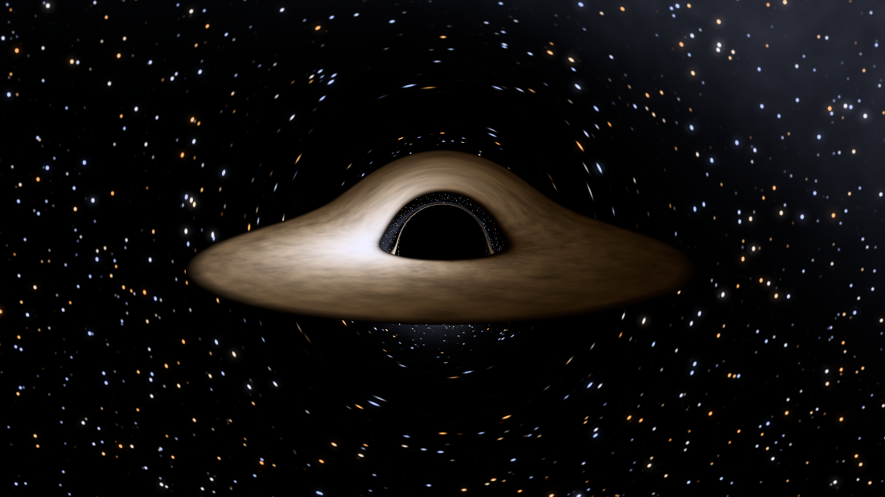
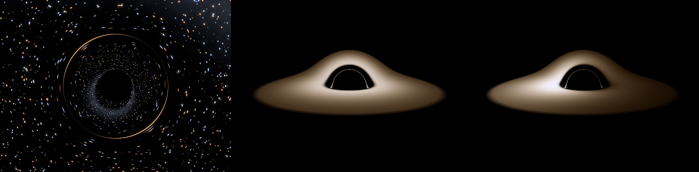

# Schwarzschild Ray Engine

A general-relativistic ray tracer in C++17. It solves the null geodesic
equations of the Schwarzschild metric to render what a black hole and its
accretion disk actually look like — gravitational lensing, the photon shadow,
relativistic beaming and all.



There are two front ends over one physics core:

- **`sre-render`** — offline CPU renderer. Multithreaded, headless, writes PNG.
  No dependencies beyond a C++17 compiler.
- **`sre-viewer`** — real-time interactive viewer. Orbit the black hole with
  the mouse and change the physics while it renders. Needs GLFW and OpenGL 3.3.

## Quick start

**Linux / macOS**

```bash
cmake -S . -B build -DCMAKE_BUILD_TYPE=Release
cmake --build build --parallel

./build/sre-render                # writes blackhole.png
./build/sre-viewer                # interactive, if GLFW was found
ctest --test-dir build            # 132 physics checks
```

**Windows** (Developer PowerShell for Visual Studio 2019+)

```powershell
cd $HOME                     # the Developer shell starts in a read-only folder
git clone https://github.com/Hussain2111/Schwarzschild-Ray-Engine.git
cd Schwarzschild-Ray-Engine

cmake -S . -B build -DSRE_FETCH_GLFW=ON
cmake --build build --config Release

.\build\Release\sre-render.exe
.\build\Release\sre-viewer.exe
ctest --test-dir build --build-config Release
```

`-DSRE_FETCH_GLFW=ON` builds GLFW as part of the project, so there is no package
manager to install first. Two Windows gotchas: the Developer shell opens inside
the Visual Studio install directory, which you cannot write to, and Visual
Studio puts the binaries in `build\Release\` rather than `build\`.

GLFW is optional everywhere. If it is missing, CMake skips the viewer and tells
you how to get it; the renderer and the test suite still build with nothing but
a C++17 compiler.

```bash
sudo apt install libglfw3-dev libgl1-mesa-dev    # Debian/Ubuntu
brew install glfw                                # macOS
```

Full per-platform instructions, including vcpkg, MSYS2/MinGW and WSL, are in
**[docs/BUILDING.md](docs/BUILDING.md)**.

## What you are looking at



**Left — lensing alone**, no disk. The dark centre is the *shadow*: a disc of
directions on the sky, `2 b_c = 5.196 r_s` across, from which no light can
reach you. That is **2.6 times wider than the event horizon**, because rays
that would have missed a Newtonian object of the same size are bent into it.
The bright circle is an Einstein ring, and the stars inside it are the sky
*behind* the black hole, wrapped around the edge.

**Middle — the disk with relativity switched off** (`--no-relativity`). The
disk still looks bent over the top of the hole, because light from the far side
is lensed up and over into view. But it is perfectly symmetric left to right.

**Right — the same disk with the physics on.** The left side is dramatically
brighter and whiter, the right side dimmer and redder. The disk's inner regions
orbit at a large fraction of the speed of light, and specific intensity scales
as `g^4` with the Doppler factor. That asymmetry is why the Event Horizon
Telescope images of M87* and Sgr A* are lopsided rings.

## Physics implemented

| | |
|---|---|
| Metric | Schwarzschild (non-rotating, uncharged) |
| Integrator | Cash-Karp 5(4) with adaptive step control (CPU); fixed-step RK4 (GPU) |
| Ray equation | `d²u/dφ² = -u + (3/2)u²`, with `u = r_s/r` |
| Camera | Static observer with correct tetrad conversion |
| Disk | Shakura-Sunyaev thin disk, zero-torque inner boundary at the ISCO |
| Relativistic transfer | Gravitational redshift, Doppler shift, `g⁴` beaming |
| Colour | Planck spectrum → CIE 1931 → sRGB, hue-preserving ACES tone mapping |
| Background | Procedural lensed star field, no assets |

Everything is derived, and its limits stated, in
**[docs/PHYSICS.md](docs/PHYSICS.md)**.

The whole simulation runs in units where `r_s = 1` and `c = 1`. The geometry is
scale free — a stellar-mass black hole and Sagittarius A* bend light identically
at the same `r/r_s` — so the renderer never needs the mass at all. Mass enters
only for reporting in SI and for computing a physically motivated disk
temperature.

Landmarks, in these units:

| | | |
|---|---|---|
| Event horizon | `r = 1` | `2GM/c²` |
| Photon sphere | `r = 1.5` | `3GM/c²` |
| ISCO | `r = 3` | `6GM/c²` |
| Critical impact parameter | `b_c = 2.598076` | `3√3 GM/c²` |

## Using the offline renderer

```bash
# A 4K frame with heavy anti-aliasing
./build/sre-render -w 3840 -h 2160 -s 4 -o hero.png

# Look down on the disk from above
./build/sre-render --elevation 65 --distance 40

# Close enough that lensing wraps the disk right around the shadow
./build/sre-render --distance 6 --elevation 25 --disk-outer 20

# Pure lensing: no disk, dense star field
./build/sre-render --no-disk --star-density 2

# A cooler, redder disk reaching in to the photon sphere
./build/sre-render --disk-temp 3500 --disk-inner 1.5

# See through the disk instead of stopping at it
./build/sre-render --thin-disk

# A 120-frame orbit, encoded to MP4 if ffmpeg is present
tools/turntable.sh 120 1280 720
```

`./build/sre-render --help` lists every option. Distances are in Schwarzschild
radii throughout.

Rendering is embarrassingly parallel, and rows are handed out atomically rather
than split into equal blocks — a ray that skims the photon sphere takes orders
of magnitude more steps than one that misses by a mile, so a static split would
leave most threads waiting on whoever drew the middle of the frame.

## Using the viewer

| Key | Action |
|---|---|
| drag / arrows | orbit the camera |
| scroll, `+` `-` | zoom |
| `[` `]` | exposure |
| `,` `.` | disk inner radius |
| `;` `'` | disk outer radius |
| `T` / `Shift+T` | disk temperature |
| `N` | cycle disk turbulence |
| `D` `S` | toggle disk / stars |
| `G` | toggle relativistic beaming and redshift |
| `O` | reverse the disk's orbital direction |
| `Space` | pause the disk animation |
| `Q` `W` | integrator steps per ray |
| `R` | reload the shader from disk |
| `P` | save a PNG screenshot |

`G` is the interesting one: toggling it on and off shows exactly how much of
the image is special-relativistic beaming.

The shader in `shaders/blackhole.frag` is the source of truth and is also baked
into the binary, so the viewer runs from anywhere while `R` still picks up
edits to the file without a rebuild.

## Tests

```bash
ctest --test-dir build --output-on-failure
```

These are not smoke tests. Almost every case compares the code against a number
general relativity fixes independently:

- Light grazing the Sun deflects by **1.75 arcseconds** (the 1919 eclipse
  result), and the weak-field limit matches `2r_s/b` — including the
  second-order `(15π/16)(r_s/b)²` term.
- Bisecting on capture-versus-escape lands on `b_c = 3√3 GM/c²` to one part in
  a million, and the deflection is verified to diverge *logarithmically* there.
- The impact parameter, an exact constant of the motion, drifts by less than
  `1e-8` over a full traversal — its drift *is* the integration error.
- The observed convergence order of the RK4 path is ~4.
- The redshift factor reduces to `√(1 - 3r_s/2r)` with no rotation, and to the
  special-relativistic `1/(1 - v/c)` far away.
- The apparent shadow radius matches `asin(b_c √f / r)` at 6, 12 and 60 `r_s`.
- The blackbody spectrum obeys Wien's displacement law.

There is also a **headless GLSL check**. The viewer's physics lives in a shader,
invisible to the C++ suite, so `tests/shader_check.cpp` creates a surfaceless
EGL context (Mesa's software rasteriser is enough), compiles the real shader,
renders a frame, and asserts it agrees with the CPU renderer on where the shadow
sits and which way the beaming points. It reports "skipped" rather than failing
on a machine with no GL stack.

## Project layout

```
include/sre/        header-only physics and rendering core
  constants.hpp       physical constants and the unit system
  vec.hpp             small vector maths
  blackhole.hpp       mass, horizon, photon sphere, ISCO, orbital kinematics
  integrator.hpp      Cash-Karp 5(4) and RK4
  geodesic.hpp        the orbit equation, plane reduction, ray marching
  disk.hpp            temperature profile, redshift, plane intersection
  color.hpp           Planck -> CIE -> sRGB, tone mapping
  starfield.hpp       procedural sky
  camera.hpp          static-observer pinhole camera
  scene.hpp           the per-ray shader
  image.hpp           framebuffer, bloom, dependency-free PNG writer
src/
  render.cpp          the sre-render CLI
  viewer.cpp          the sre-viewer application
  gl_loader.hpp       minimal OpenGL 3.3 loader
shaders/              the GPU port of the same physics
tests/                physics suite and headless GLSL check
tools/turntable.sh    orbit animation helper
docs/PHYSICS.md       full derivation, and what is not modelled
docs/BUILDING.md      per-platform build instructions
legacy/               the original single-file version, kept for comparison
```

## What is not modelled

Stated plainly, because it matters more than the feature list:

- **Rotation.** Real black holes spin. This is Schwarzschild only — the Kerr
  metric would drag the ISCO inwards, distort the shadow, and break the
  planarity that makes the whole approach here so cheap.
- **A moving camera.** The observer is static; an orbiting one would see the
  image aberrated by its own velocity.
- **Disk thickness, scattering, self-illumination, and returning radiation.**
- **Light travel time differences** between paths, and **polarisation**.

`docs/PHYSICS.md` covers each in more detail.

## Relation to version 1

The original was a single 130-line file that printed `r` and `phi` to the
console. `legacy/blackhole_v1.cpp` keeps it for comparison; the header on that
file lists what changed and why. The short version:

- integration in SI at `r ~ 1e12` lost most of its precision to cancellation,
  where `r_s = 1` units keep every term `O(1..100)`;
- forward Euler is first-order *and* unstable on an oscillatory orbit, where
  Cash-Karp is fifth-order with error control;
- the mass was hard-coded inside `Ray` and `calAcc` rather than taken from the
  `BlackHole` it was orbiting;
- and there was no way to see the result.

## License

MIT — see [LICENSE](LICENSE).
